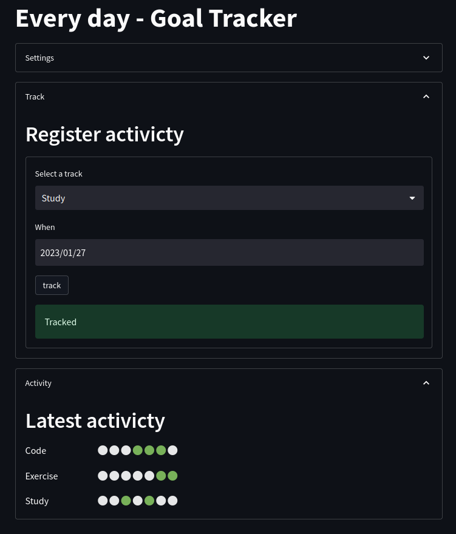

# Steamlit demos

Just a few tests and small examples using [streamlit](https://streamlit.io/).

See [streamlit docs](https://docs.streamlit.io/library/get-started/installation) for how to install and run apps.

## Every day

This is a small goal tracker. You can add "tracks" of things you want to do everyday, like exercise or study, and than track if you are doing it everyday.

## License

MIT
